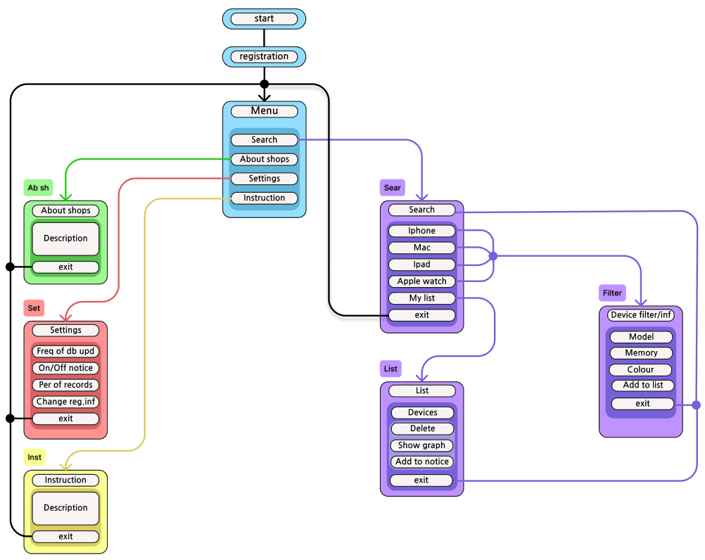
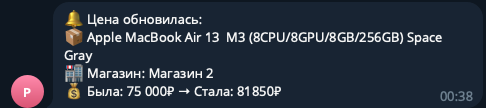

# Parser1
I decided to write a static parser for apple electronics stores. The parser will be automatically updated every 3 days and plot price changes for each model + write data to excel (so far only there).
The project is almost complete, I did not make functionality for the iPad and Apple Watch because it takes a very long time to write a normal parser, and I just wanted to get acquainted with the basics of parsing.
It remains only to slightly edit the function of displaying changes in product prices and write a short instruction and explanation of the work done. Next, it is planned to write a parser for a dynamic site, but using orm (alchemy).

In general, the project is almost completed. I have sent notifications for items from my list marked "receive notifications"

Overall, the project is almost complete. I have orealized notifications by items from my list marked "receive notifications". 
Now I understand that many points could have been implemented better, but because of my studies, I sometimes had to take breaks of 5-6 days, which negatively affected the project.
I also don't have much experience in full-fledged project creation, one simple image in Figma is clearly not enough((
There were also problems with parsing the site, namely that the design of the product information was too different (even on one site there were 5-6 different variations, for example, different registers or, for example, Gb is written somewhere and not somewhere), so it was very difficult to make a keyboard for searching. It was necessary to get information sequentially, first about the series, then about the model, then about the memory for this model, in order to get the colors for this model with such memory and check that there were no repetitions.
It was a mistake to represent the product (the color memory model) as a row, it was tedious to split each of the parameters into separate columns, but then a separate table would have to be created for each type of product, which at that time seemed to me more complicated and voluminous.

В целом, проект практически завершен. Я ореализовал уведомления по пунктам из своего списка с пометкой "получать уведомления". 
Сейчас я понимаю, что многие пункты можно было бы реализовать лучше, но из-за учебы мне приходилось иногда делать перерывы в 5-6 дней, что негативно сказывалось на проекте.
У меня также нет большого опыта в полноценном создании проектов, одной простой картинки в Figma явно недостаточно((
Также были проблемы с парсингом сайта, а именно с тем, что оформление информации о товаре было слишком разным (даже на одном сайте было 5-6 разных вариаций, например, разные регистры или, например, где-то написано Gb, а где-то нет), поэтому было очень сложно сделать клавиатуру для поиска. Нужно было получить информацию последовательно, сначала о серии, затем о модели, затем о памяти для этой модели, чтобы получить цвета для этой модели с такой памятью и проверить, чтобы не было повторений.
Ошибкой было представлять продукт (модель color memory) в виде строки, было утомительно разбивать каждый из параметров на отдельные столбцы, но тогда для каждого типа продукта нужно было бы составлять отдельную таблицу, что на тот момент казалось мне более сложным и объемным.
