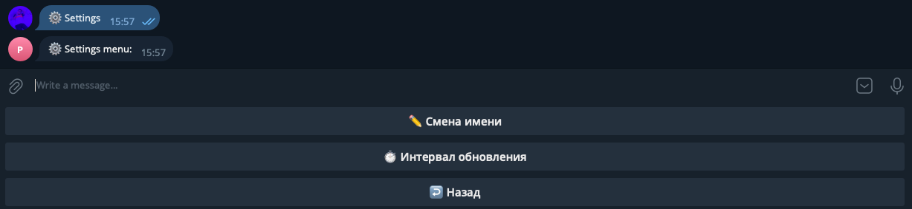

# Parser1
I decided to write a static parser for apple electronics stores. The parser will be automatically updated every 3 days and plot price changes for each model + write data to excel (so far only there).
The project is almost complete, I did not make functionality for the iPad and Apple Watch because it takes a very long time to write a normal parser, and I just wanted to get acquainted with the basics of parsing.
It remains only to slightly edit the function of displaying changes in product prices and write a short instruction and explanation of the work done. Next, it is planned to write a parser for a dynamic site, but using orm (alchemy).

Approximate scheme of the project

First of all we use command /start (to run tg bot). 

After this command username and id automatically recorded to "User" table

You can change your name or db refresh using "settings" button

Also, bot send messages about products changed price from "my_list"

Buttons Instr and Ab. shops just give an information about they (I don't add full description)

User can get exel file with full information from db

Searching is a main Kb, here we can find the product we are interested in, add it in "my_list"

For example

In my list we can see all our goods

We can delete them from list, on/off notice (price change) for each product. All changes confirm after "confirm" button.
Also, we can see graphics of price changing for each product.
